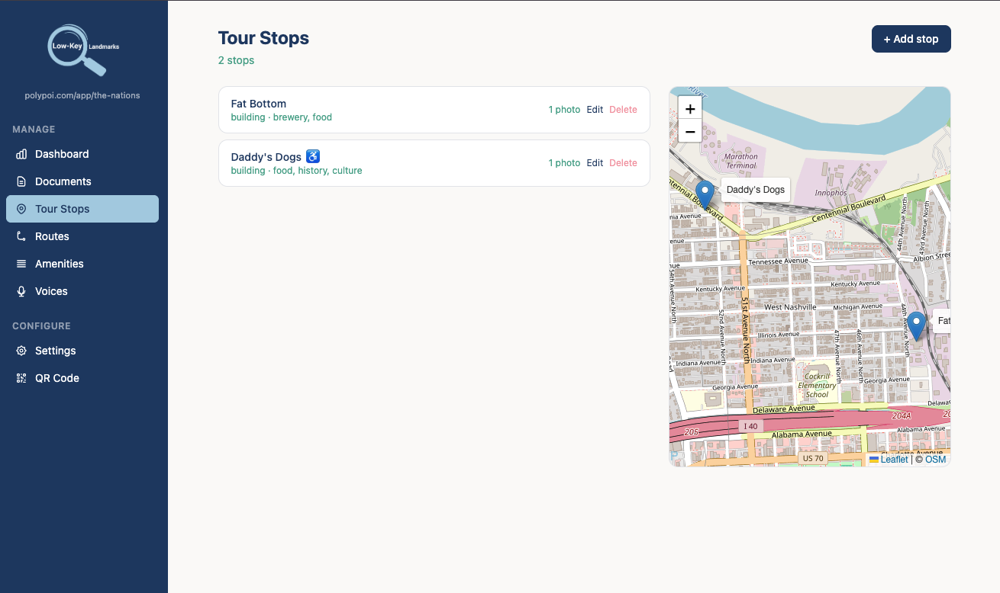

# Low-Key Landmarks



**AI-powered tour guides for any point of interest.**

Low-Key Landmarks is a platform where site staff stand up a fully branded visitor experience without writing code. Each site gets its own chatbot, interactive map, personalized stop recommendations, and optional AI voice read-aloud powered by the site's uploaded content and structured records.

The internal project name remains **PolyPOI** in code, package names, environment variables, and repository paths.

---

## What it does

**For visitors** — Scan a QR code on arrival and open a mobile web app. Ask questions in plain language, explore an interactive map, get personalized stop suggestions, and optionally use voice dictation or listen to chatbot responses.

**For staff** — Log in to an admin portal, upload documents, add tour stops, configure branding, manage amenities and routes, and create voice characters for the visitor chatbot.

---

## Visitor experience

| Module              | What it does                                                                                                         |
| ------------------- | -------------------------------------------------------------------------------------------------------------------- |
| **Chatbot**         | Answers natural-language questions from the site's own knowledge base (RAG). Acknowledges gaps rather than guessing. |
| **Interactive map** | Shows tour stops and amenities (restrooms, food, parking). Tap a stop for details and photos.                        |
| **Guided routes**   | Pick a staff-curated route on the map to trace an ordered path between stops and follow it end to end.              |
| **Recommendations** | Asks a few quick preference questions and suggests stops matched to the visitor's interests.                         |
| **Amenity lookup**  | Always-on quick access to practical info — hours, emergency contacts, accessibility.                                 |
| **Voice mode**      | Lets visitors dictate questions and play chatbot responses aloud with a site-configured voice character.             |

---

## Admin portal

Staff manage their site through a guided web portal:

- **Onboarding wizard** — set up org identity, branding colors, logo, and tone
- **Document uploads** — PDFs and docs are chunked, embedded, and added to the knowledge base automatically
- **Stop management** — add tour stops with GPS coordinates, photos, and interest tags
- **Route builder** — arrange stops into ordered guided routes visitors can follow on the map
- **Amenity records** — structured forms for restrooms, food, parking, emergency info
- **Voice characters** — design reusable chatbot voices for visitor read-aloud
- **QR code download** — generates a scannable PNG linking visitors to the site

---

## Tech overview

| Layer    | Choice                                                                                         |
| -------- | ---------------------------------------------------------------------------------------------- |
| Backend  | Python + FastAPI                                                                               |
| Frontend | React + Vite (TypeScript + Tailwind)                                                           |
| Database | Supabase (Postgres + pgvector + Auth + Storage)                                                |
| AI       | OpenAI GPT-4o (chat), text-embedding-3-small (embeddings), gpt-4o-mini-transcribe (dictation) |
| Voice    | Hume.ai Octave for text-to-speech and voice design                                             |
| Hosting  | Railway (API, worker, Redis) + Vercel (frontend) + Supabase cloud                              |

Each site is a **tenant** — isolated by `tenant_id` at the database layer, with its own branding, content, and configuration.

---

## Getting started

```sh
make setup                               # install Python + Node deps
cp .env.example .env.local               # add Supabase, OpenAI, and Hume credentials
make backend                             # API at http://localhost:8000
make frontend                            # app at http://localhost:5173
```

Credentials: Supabase dashboard → Settings → API (use legacy anon/service_role keys). OpenAI and Hume credentials are required for AI chat, dictation, and voice playback.

See `CLAUDE.md` for agent-focused development conventions and project structure.
